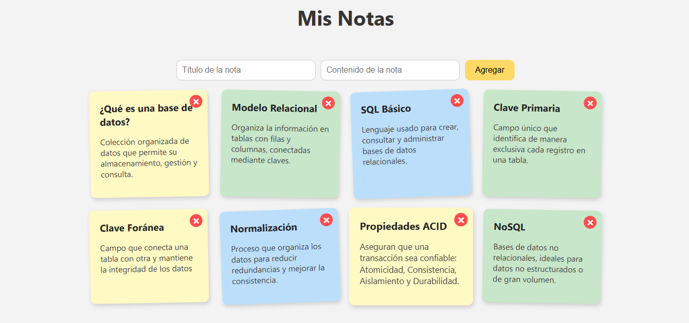

# Notas Rápidas
Un proyecto simple hecho con **HTML, CSS y JavaScript** para practicar lo básico del desarrollo web.  
Permite escribir notas rápidas, mostrarlas en una lista y eliminarlas con un clic.

## Funcionalidades
- Agregar una nota en un cuadro de texto.
- Mostrar las notas en una lista.
- Eliminar notas haciendo clic sobre el icono ✖.
- Guardar notas en el navegador con `localStorage`.

## Tecnologías utilizadas
- HTML5
- CSS3
- JavaScript

## Vista previa

## Cómo probarlo
1. Descarga este repositorio.
2. Abre el archivo `index.html` en tu navegador.
3. ¡Empieza a escribir tus notas!

## Autor
Creado por **[yoscelimesther18-crypto]** 

